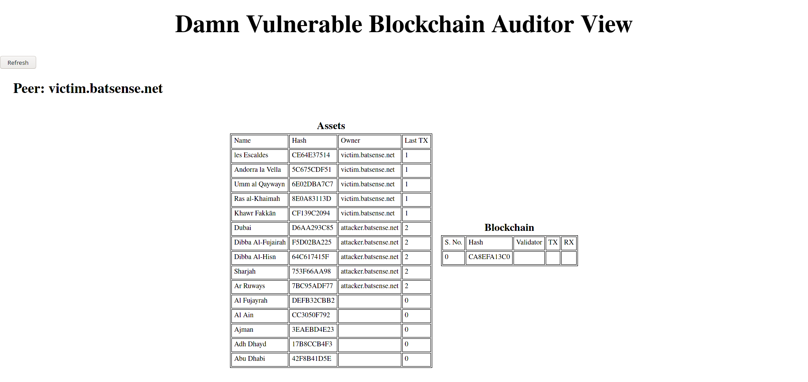
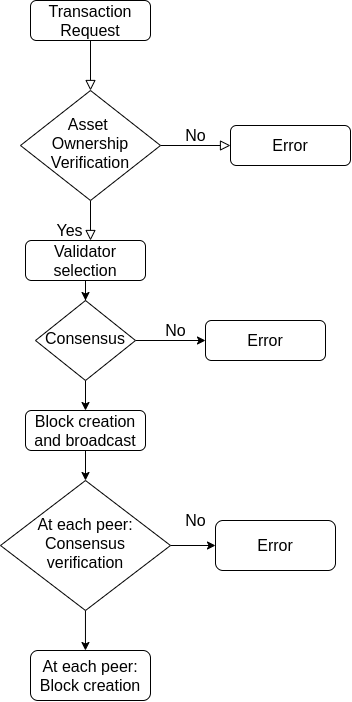

<div align="center">


# Damn Vulnerable Blockchain

/badge.svg>)
[](https://realaravinth.github.io/damn-vuln-blockchain/damn_vuln_blockchain/index.html)
[](https://codecov.io/gh/realaravinth/damn-vuln-blockchain)
[](http://www.gnu.org/licenses/agpl-3.0)
[](https://deps.rs/repo/github/realaravinth/damn-vuln-blockchain)

</div>

This is a test blockchain that I build for fun and as the name
suggests, **it is bloody vulnerable.**

## How to build

- Install Cargo using [rustup](https://rustup.rs/) with:

```
$ curl --proto '=https' --tlsv1.2 -sSf https://sh.rustup.rs | sh
```

- Clone the repository with:

```
$ git clone https://github.com/realaravinth/damn-vuln-blockchain
```

- Build with Cargo:

```
$ cd damn-vuln-blockchain && cargo build
```

## Usage:

`Damn Vulnerable Blockchain` comes with a peer implementation called
`dwb`. `dwb` supports three modes:

| Mode     | Function                                                                                     |
| -------- | -------------------------------------------------------------------------------------------- |
| Attacker | Configured to fork the blockchain and perform a double spend. See                            |
| Auditor  | This is a special peer that acts as the discovery node and mint. It should be spawned first. |
| Victim   | This peer will be configured to take itself down when an attack command is issued.           |
| Normal   | No special abilities, just an other node in the network                                      |

### `dwb` usage:

```
Damn Vulnerable Blockchain 0.1
Aravinth Manivannan <realaravinth@batsense.net>
A bloody vulnerable blockchain implementation

USAGE:
    dwb --auditor <auditor> --mode <mode> --network-size <network_size> --name <peer_id> --public-ip <public_ip>

FLAGS:
    -h, --help       Prints help information
    -V, --version    Prints version information

OPTIONS:
    -a, --auditor <auditor>              address of auditor node
    -m, --mode <mode>                    available modes:
                                         	auditor
                                         	normal
                                         	attacker
                                         	victim
    -s, --network-size <network_size>    set intial network size
    -n, --name <peer_id>                 set peer name
    -i, --public-ip <public_ip>          set public IP
```

### Spinning up a cluster:

The easiest way to spin up a cluster locally is using `./network.sh`.

```
USAGE:
USAGE:
  ./network.sh
  launch		 launches test network
		release  launches network in production setup(seperate auditor launch)
		auditor  launches auditor
  kill			 kills test network
		release  kills network in production setup(seperate auditor launch)
		auditor  kills auditor
```

### Web interface:

A read-only web interface is available at the root of every peer. It is
capable of aggregating state from all peers in network and displaying it.

<div align="center" >

</div>

## Transaction Wrokflow:

<div align="center" >

</div>

## Attack Scenario:

### Network Topology

<div align="center" >

</div>

1. Fork chain on `attacker`:
   This makes a copy of `AssetLedger` and `Chain` state which can be
   exposed to `victim` later in the attack

```bash
$ curl -X POST localhost:7001/fork
```

2. Set attack on `victim`:
   This simulates DoS on the victim and effectively blacking itself out.

```bash
$ curl -X POST localhost:7002
```

3. Sell asset from `attacker` to `normal`:

```bash
$ curl -X POST 'localhost:7001/assets/sell' \
--header 'Content-Type: application/json' \
--data-raw '{
    "asset_id": "4D2DF03943EA557997577CD2F52AB707A10D75D59A2B5C3682CDFA9816CD120F",
    "buyer_peer_id": "normal.batsense.net" }'
# replace peer ID and asset ID
```

4. Set attack on `attacker`

5. Sell same asset from step 3 to `victim`:

```bash
$ curl -X POST 'localhost:7001/assets/sell' \
--header 'Content-Type: application/json' \
--data-raw '{
    "asset_id": "4D2DF03943EA557997577CD2F52AB707A10D75D59A2B5C3682CDFA9816CD120F",
    "buyer_peer_id": "victim.batsense.net" }'
# replace peer ID and asset ID
```

### Credits:

Logo made by [Freepik](https://www.flaticon.com/authors/freepik) from
[Flaticon](https://www.flaticon.com). Do check them out!
